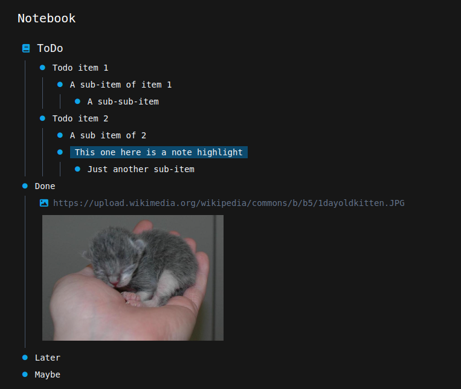

# Notebook

A personal toy project for a custom note-taking app.
Hacked together in a few hours and unfinished.
Not ready for use, just hacking a proof-of-concept.

## Run demo

* run `docker compose up -d`
* open http://localhost:1234

## Screenshots

